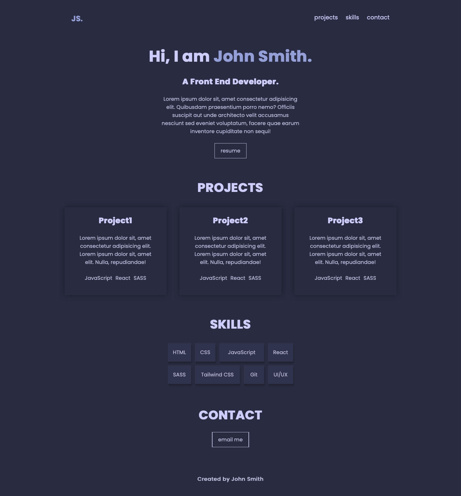

# React JS Poject: Simplefolio

A practical project for Supercode Fullstack Web-Dev Bootcamp. The first day React JS

- working with components.
- structuring and organizing a React page (Where are redundancies?Where can I reuse a component?)
- creating multiple components (modular structure)
- styling multiple components

## Demo Link

https://cerulean-beignet-efdaac.netlify.app/

## Screenshots 📸

## Tech Stack 💻

Client:

- react
- CSS
- vite
- JavaScript
- GIT

Server:

- GitHub
- netlify
